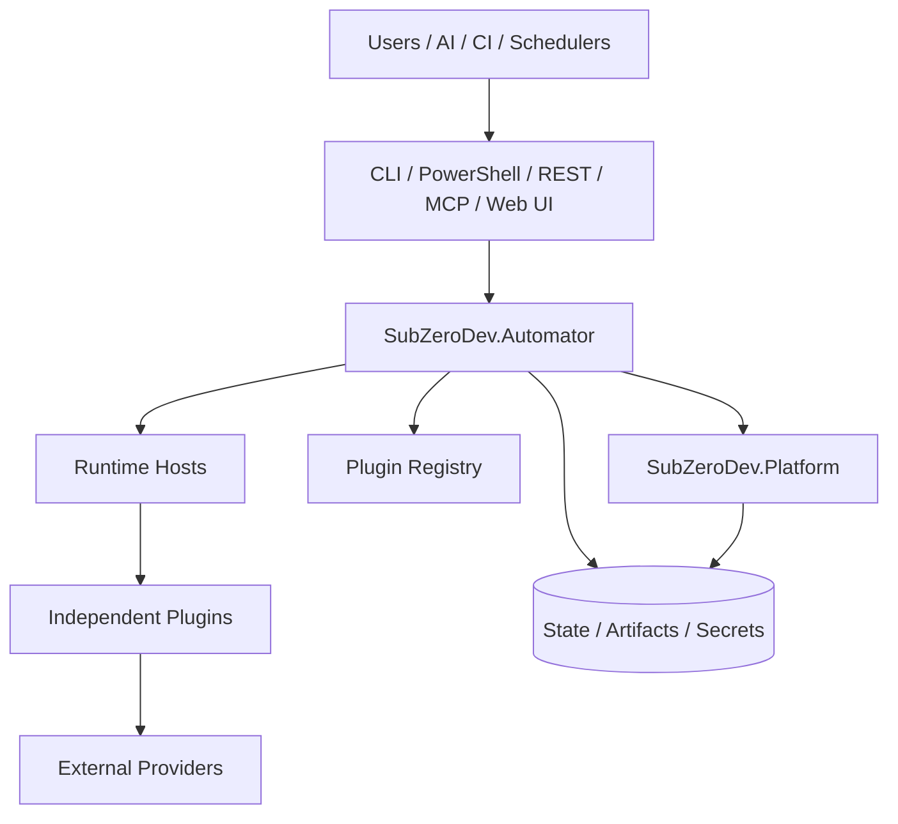

# Ecosystem Architecture

## Logical architecture



## Dependency rules

### Platform

May depend on:

- .NET and ASP.NET Core
- selected provider abstractions
- persistence abstractions
- observability libraries
- security libraries

Must not depend on:

- Automator
- GitHub plugin
- Requirements Compiler
- ContainerPSGenerator
- build-specific code
- product-specific workflows

### Automator

May depend on:

- Platform
- plugin contracts
- workflow contracts
- runtime-host abstractions

Must not contain:

- provider-specific GitHub collection logic
- Docusaurus generation
- package build behavior
- code generation behavior
- AI prompt logic specific to a plugin
- arbitrary product business rules

### Plugins

May depend on:

- Platform SDK packages when useful
- plugin SDK packages
- external provider SDKs
- language-specific libraries

Must not depend on Automator internals.

## Interaction styles

A plugin command may be invoked by:

```text
Manual CLI
PowerShell wrapper
Automator workflow
REST endpoint
MCP tool
Scheduled execution
Remote agent
CI pipeline
```

All invocation styles must converge on one normalized command invocation model.

## Canonical execution model

```text
Plugin Identity
+ Plugin Version
+ Command
+ Inputs
+ Environment
+ Secret References
+ Execution Target
+ Timeout / Retry Policy
= Invocation Request
```

The execution result returns:

```text
Status
Exit Code
Structured Output
Logs
Warnings
Errors
Artifacts
Timing
Runtime Metadata
```

## Architecture style

The ecosystem should favor:

- explicit contracts
- composition over inheritance
- independent process boundaries for untrusted or independently versioned tools
- stable internal models
- provider adapters
- deterministic outputs
- generated clients where possible
- schema versioning
- idempotent operations where practical
