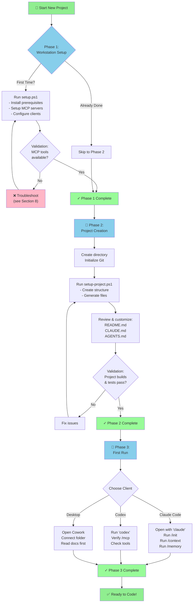
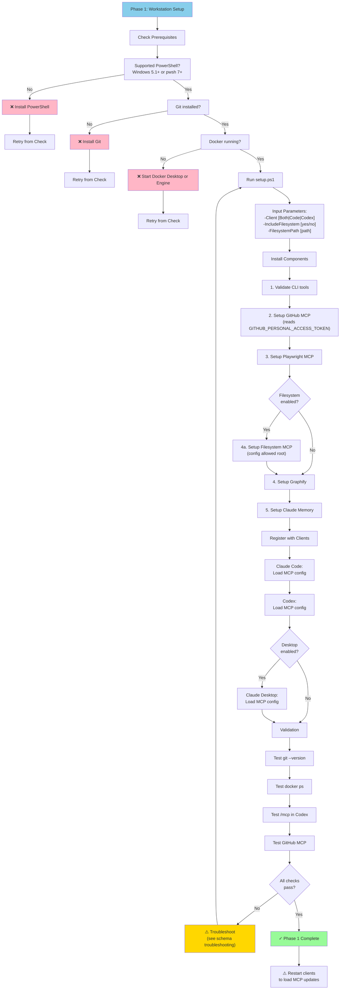
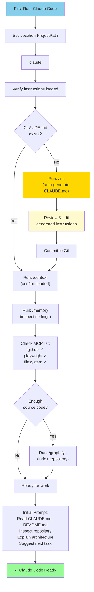
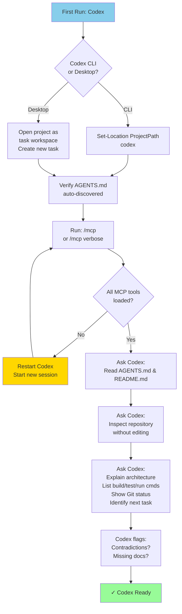
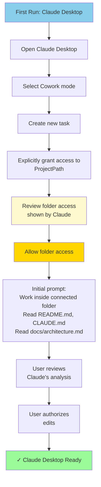
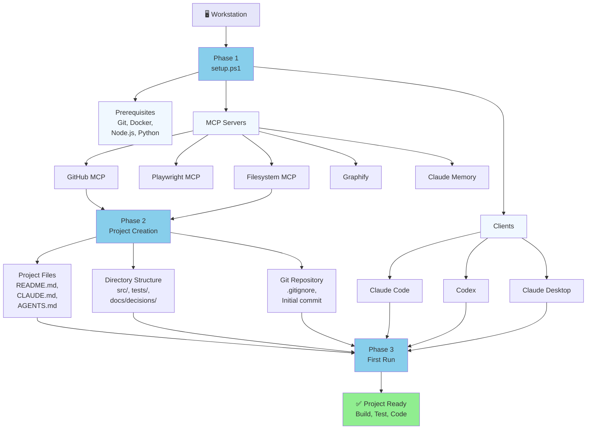
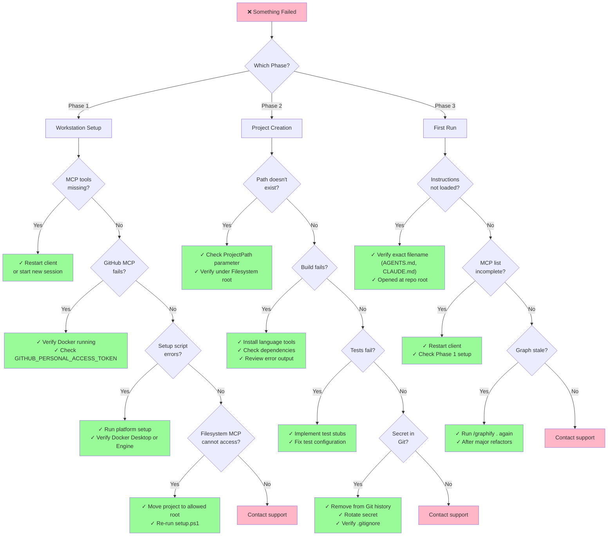
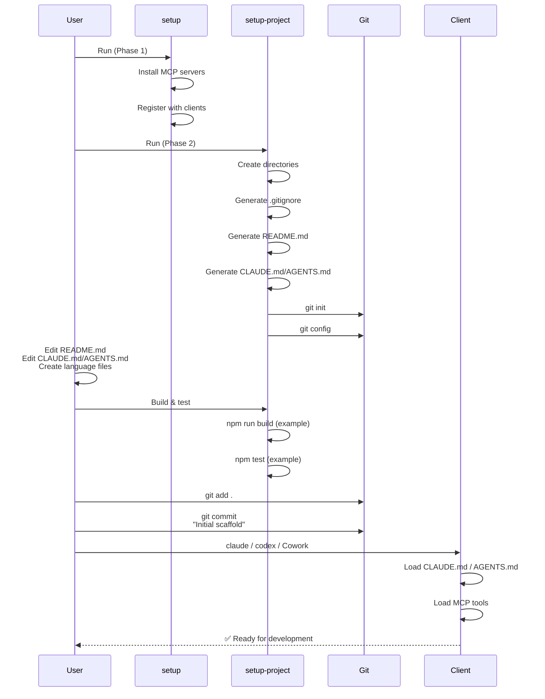
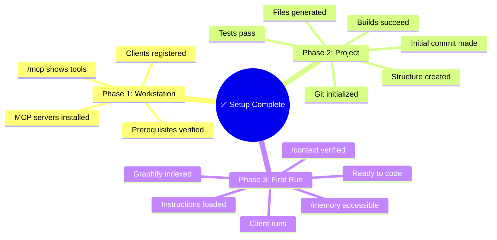

# Setup Workflow Flowcharts and Diagrams

**Visual representations of the three-phase setup process defined in the [setup specification](./setup-specification.md).**

---

## 1. Overall Setup Process Flow



---

## 2. Phase 1: Workstation Setup Detailed Flow



---

## 3. Phase 2: Project Creation Detailed Flow

```mermaid
graph TD
    P2Start["Phase 2: Project Creation"] --> ValidatePath["Validate ProjectPath"]
    
    ValidatePath --> CheckFSRoot["Is path under<br/>Filesystem MCP root?"]
    CheckFSRoot -->|No| PathError["❌ Move to allowed root<br/>or re-run setup"]
    PathError --> ValidatePath
    
    CheckFSRoot -->|Yes| CheckExists["Project already<br/>exists?"]
    CheckExists -->|Yes| ExistsError["❌ Choose different path"]
    ExistsError --> ValidatePath
    
    CheckExists -->|No| CreateDirs["Create Directory Structure"]
    
    CreateDirs --> CreateRoot["mkdir ProjectPath"]
    CreateRoot --> CreateSrc["mkdir src/"]
    CreateSrc --> CreateTests["mkdir tests/"]
    CreateTests --> CreateDocs["mkdir docs/decisions/"]
    CreateDocs --> CreateGithub["mkdir .github/"]
    
    CreateGithub --> GenFiles["Generate Project Files"]
    
    GenFiles --> GenGitignore[".gitignore<br/>(secrets, build, IDE)"]
    GenGitignore --> GenEnvExample[".env.example<br/>(template with placeholders)"]
    GenEnvExample --> GenReadme["README.md<br/>(scaffolded with language cmds)"]
    GenReadme --> GenArch["docs/architecture.md<br/>(template)"]
    GenArch --> GenADR["docs/decisions/0001-*.md<br/>(ADR template)"]
    
    GenADR --> GenInstructions["Generate Client Instructions"]
    
    GenInstructions --> ClientCheck{Clients<br/>enabled?}
    
    ClientCheck -->|Code| GenClaude["Generate CLAUDE.md<br/>- Commands for language<br/>- Architecture principles<br/>- Workflow rules<br/>- MCP tools list"]
    ClientCheck -->|Codex| GenAgents["Generate AGENTS.md<br/>- Commands for language<br/>- Architecture principles<br/>- Workflow rules<br/>- MCP tools list"]
    
    GenClaude --> GenAgents
    GenAgents --> GitInit["Initialize Git Repository"]
    
    GitInit --> GitCheck{-SkipGit flag?}
    GitCheck -->|Yes| SkipGit["Skip Git init"]
    GitCheck -->|No| DoGitInit["git init"]
    
    DoGitInit --> GitConfig["Configure Git<br/>user.name & user.email"]
    GitConfig --> GitKeep["Create .gitkeep<br/>in src/ and tests/"]
    
    GitKeep --> Customize["User: Review & Customize"]
    
    Customize --> EditReadme["✏️ Edit README.md<br/>- Add prerequisites<br/>- Add setup steps<br/>- Document build/test/run"]
    EditReadme --> EditInstructions["✏️ Edit CLAUDE.md/AGENTS.md<br/>- Refine commands<br/>- Add architecture notes<br/>- Adjust rules for project"]
    EditInstructions --> EditArch["✏️ Edit docs/architecture.md<br/>- Document components<br/>- Add data flow"]
    
    EditArch --> CreateLangFiles["Create Language-Specific Files<br/>(package.json, requirements.txt, etc.)"]
    
    CreateLangFiles --> BuildTest["Build & Test Project"]
    
    BuildTest --> Build["Run: [build command]"]
    Build --> BuildPass{Build<br/>succeeds?}
    
    BuildPass -->|No| BuildFix["❌ Fix build errors"]
    BuildFix --> Build
    
    BuildPass -->|Yes| Test["Run: [test command]"]
    Test --> TestPass{Tests<br/>pass?}
    
    TestPass -->|No| TestFix["❌ Fix test failures"]
    TestFix --> Test
    
    TestPass -->|Yes| Commit["Initial Git Commit"]
    
    Commit --> GitAdd["git add ."]
    GitAdd --> GitCommit['git commit -m<br/>"Initial project scaffold"']
    
    GitCommit --> P2Done["✓ Phase 2 Complete"]
    
    style P2Start fill:#87CEEB
    style P2Done fill:#98FB98
    style Customize fill:#FFFACD
    style BuildFix fill:#FFD700
    style TestFix fill:#FFD700
    style PathError fill:#FFB6C6
    style ExistsError fill:#FFB6C6
```

---

## 4. Phase 3: First Run Workflows

### 4.1 Claude Code First Run



### 4.2 Codex First Run



### 4.3 Claude Desktop (Cowork) First Run



---

## 5. Dependency & Component Graph



---

## 6. Troubleshooting Decision Tree



---

## 7. File Lifecycle



---

## 8. Success Criteria Checklist



---

## References

- [Setup specification](./setup-specification.md) — Complete specification document
- **setup.ps1** — Phase 1 workstation setup script
- **setup-project.ps1** — Phase 2 & 3 project creation script
- `config/setup-schema.json` — Configuration schema
- `config/setup-config.example.yaml` — Example configuration
